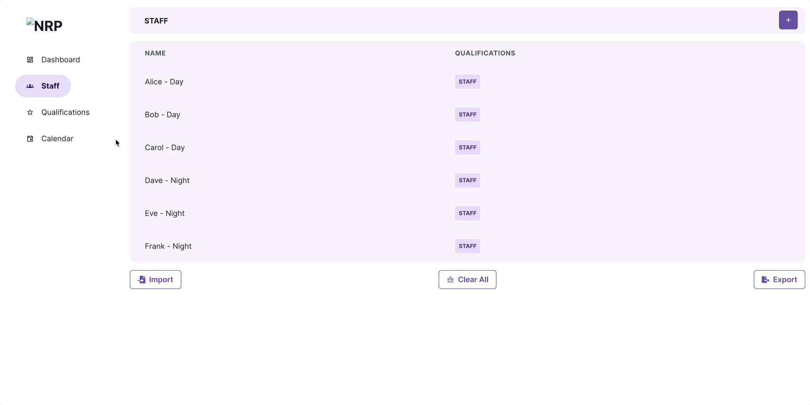

This is a [Next.js](https://nextjs.org/) project bootstrapped with [`create-next-app`](https://github.com/vercel/next.js/tree/canary/packages/create-next-app).

## Getting Started

Fist, install the dependencies:

```bash
yarn install
#or
npm install
```

Then, run the development server:

```bash
yarn dev
# or
npm run dev
```

Open [http://localhost:3000](http://localhost:3000) with your browser to see the result.

You can start editing the page by modifying `pages/index.tsx`. The page auto-updates as you edit the file.

[API routes](https://nextjs.org/docs/api-routes/introduction) can be accessed on [http://localhost:3000/api/hello](http://localhost:3000/api/hello). This endpoint can be edited in `pages/api/hello.ts`.

The `pages/api` directory is mapped to `/api/*`. Files in this directory are treated as [API routes](https://nextjs.org/docs/api-routes/introduction) instead of React pages.

## Learn More

To learn more about Next.js, take a look at the following resources:

- [Next.js Documentation](https://nextjs.org/docs) - learn about Next.js features and API.
- [Learn Next.js](https://nextjs.org/learn) - an interactive Next.js tutorial.

You can check out [the Next.js GitHub repository](https://github.com/vercel/next.js/) - your feedback and contributions are welcome!

## Deploy with Node.js

Easy-to-follow instructions as the following link:
[Deploying with other hosting options](https://nextjs.org/learn/basics/deploying-nextjs-app/other-hosting-options)

## Deploy on Vercel

The easiest way to deploy your Next.js app is to use the [Vercel Platform](https://vercel.com/new?utm_medium=default-template&filter=next.js&utm_source=create-next-app&utm_campaign=create-next-app-readme) from the creators of Next.js.

Check out our [Next.js deployment documentation](https://nextjs.org/docs/deployment) for more details.

## User Interface

Below are some screenshots of the project UI:

### Home Page


This is the **homepage**

### Dashboard


This is the dashboard showing the scheduling

## Application Preview

### Create staff


Create staff **Frank**, who preferred night shifts

### Set qualification



Set the at least **1 staff** that must be on the clock at all times.

### Schedule


Schedule and get the timetable